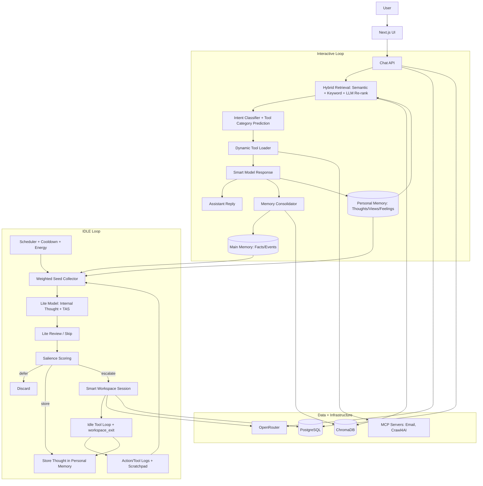

# Continua

> **A local-first AI assistant with persistent memory, autonomous IDLE cognition, and tool-using agency.**

This project is not designed as a request-only chatbot. It is human brain inspired continuously updating cognitive system:
- It remembers users and context through long-term memory.
- It runs an internal IDLE loop between chats.
- It can escalate internal thoughts into autonomous workspace sessions.
- It maintains private first-person memory that shapes its evolving perspective.


---

## Why This Architecture Is Different

Most assistants are stateless request handlers. This assistant is architected as a dual-loop system:
1. **Interactive loop (chat):** responds to the user with memory-augmented reasoning and tool use.
2. **Background loop (IDLE):** generates internal thoughts, evaluates salience, stores insights, and sometimes acts autonomously.

The key innovation is not just memory retrieval. It is the combination of:
- memory retrieval,
- internal thought generation,
- salience gating,
- identity/perspective accumulation,
- and controlled autonomous execution.

This gives the assistant continuity, self-consistency, and a recognizable point of view over time.

---

## Interaction

Interacting with Continua is different from using a stateless chatbot. Because it has continuity, long-term memory, and background cognition, it works better when treated as an ongoing relationship rather than a sequence of isolated prompts.

If you want the agent to do something differently, or avoid certain behavior, talk to it about that directly instead of only refining the system prompt. In practice, that approach works better with the way the system builds memory, internal perspective, and behavioral continuity over time.

There is no large predefined memory seed at startup, so a longer initial conversation is strongly recommended. Early interaction helps the system build context about you, your priorities, and the world it is operating in. Sustained interaction in a specific direction tends to reinforce that direction. If you repeatedly explore a topic, workflow, or area of responsibility, the agent is more likely to research it further, improve within that domain, and take more coherent steps there over time. Broad, varied conversation is also useful because it gives the system a richer base of memories and associations to draw from.

---

## Cognitive Architecture



---

## IDLE State Deep Dive

IDLE mode is a background cognition pipeline that models a calm internal mind rather than constant action.

### 1) Seed Substrate (What can trigger thought)
Seeds come from:
- Main memory
- Personal memory
- Personal memory context snippets
- Scratchpad notes (priority)
- Due calendar events (can trigger direct workspace start)

Seed selection is **weighted**, not random:
- recency weighting,
- resonance intensity weighting,
- access-frequency priming,
- anti-rumination penalty for overused seeds.

### 2) Lite Thought Generation
A low-cost model generates a short internal thought with TAS metadata:
- `temporal`: past/present/future
- `valence`: negative/neutral/positive
- `self_relevance`: low/medium/high
- `novelty`: low/medium/high

Optional lightweight review can revise or skip the thought before scoring.

### 3) Salience Gating
Every thought is scored. Decision outcomes:
- `defer`: ignore
- `store`: persist as personal memory
- `escalate`: open a smart workspace session

Scoring blends:
- TAS signals
- action cues
- novelty boosts
- seed source/context
- persona overlap (keyword or semantic)
- similarity penalties (anti-repeat)
- emotional momentum adjustment

### 4) Dynamic Energy + Emotional Momentum
IDLE escalation is not static:
- **Energy** rises with user activity and decays exponentially after cooldown.
- Escalation threshold is lowered when energy is high.
- **Emotional momentum** tracks short-term affective direction (-1 to +1) and biases salience for coherent emotional continuity.

### 5) Associative Thought Chaining
Thoughts can mark `expand=true`.
If chaining is enabled/probable, a second linked thought is generated to simulate associative drift without full escalation.

### 6) Smart Workspace Escalation
On escalation, the assistant enters a per-tick workspace session with:
- persona anchor,
- related recent thoughts/actions,
- memory recall injected from escalated thought,
- tool access,
- explicit `workspace_exit` termination.

Outputs include:
- tool-backed work,
- draft actions,
- scratchpad notes,
- stored personal thought updates.

---

## How The Assistant Develops Its Own Views

The assistant has a dedicated private memory channel for first-person internal state, not just user facts.

### Personal memory categories
`feeling`, `experience`, `thought`, `view`, `opinion`

### Identity loop
1. Personal/internal thoughts are stored over time.
2. Persona refinement synthesizes these memories into a compact profile.
3. The profile is injected back into system prompts.
4. Future idle scoring is partially filtered by persona overlap.

This creates measurable continuity in:
- what she cares about,
- what she prioritizes,
- how she frames decisions,
- how her internal tone evolves.

It is a computational identity loop: persistent memory -> synthesized persona -> behavior bias -> new memory.

---

## Agentic Execution Model

The assistant can act, but with guardrails:
- Email favors drafts before send.
- Duplicate-reply protection via `replyStatus` metadata.
- Workspace file operations are root-guarded and recycle-bin protected.
- System-file tools are read-only.
- Tool use is logged for observability (`/idle-workspace`, `/idle-metrics`, chat injection inspector).

Chat and IDLE both support multi-step tool loops, but IDLE is intentionally more conservative and gated by salience.

---

## SSEF: Skill Evolution Framework

This project includes an internal subsystem called **SSEF** (Skill Evolution Framework) for controlled skill creation and activation.

### What SSEF does
- Lets the assistant submit a structured skill request (`ssef_propose_skill`) when it detects a capability gap.
- Runs a forge loop that can generate code with an LLM, run sandbox tests, and iteratively refine artifacts.
- Enforces policy/runtime limits (permissions, path jail, timeout, output bounds, process limits).
- Requires human approval before a forged artifact can become an active runtime tool.
- Supports rollback/disable if a promoted skill misbehaves.

### How it works (overview)
1. The assistant creates a proposal (spark) with problem, desired outcome, inputs, and constraints.
2. Operator reviews proposals in **`/ssef`** and starts forge processing (single run or queue batch), selecting model + reasoning effort.
3. Forge performs: generation -> sandbox tests -> functional/safety critic -> security summary.
4. If review-ready, operator approves/rejects; approval promotes immutable artifact into the vault and marks it active.
5. Active SSEF skills are injected into both chat and IDLE tool registries as callable tools.
6. SSEF runtime skills are loaded via relevance-selective injection (top matching subset) to protect context window as skill count grows.

### What The Assistant Gets From SSEF
- New task-specific tools beyond built-ins (API bridges, transformations, automations, compositions).
- Reuse/composition-first behavior via semantic retrieval before creating net-new skills.
- Versioned skill lifecycle with auditability rather than one-off prompt hacks.

### Operational Notes
- SSEF bootstraps its own managed workspace namespace (`.ssef`) on startup.
- It does **not** depend on pre-existing personal folders being committed in the repository.
- Main operator surface: **`/ssef`** (proposals, forge diagnostics, review queue, approvals, rollback, cleanup/reset).

---

## Built-In Tools (Current)

Tool loading is dynamic in chat (intent-based categories) plus always-on core tools.

| Category | Tools | Chat | IDLE |
|---|---|---|---|
| Email | `list_accounts`, `list_folders`, `list_messages`, `get_message`, `create_draft`, `send_message`, `reply` | Yes (intent-loaded) | Yes |
| Web Knowledge | `wiki_search`, `wiki_summary`, `wiki_page` | Yes (intent-loaded) | Yes |
| Crawl4AI (MCP) | MCP-discovered Crawl4AI tools (search/map/crawl/extract/fetch depending on server) | Yes (intent-loaded) | Yes |
| Calendar | `add_calendar_event`, `list_calendar_events`, `update_calendar_event`, `delete_calendar_event` | Yes (intent-loaded) | Yes |
| Workspace Docs | `doc_create_file`, `doc_read_file`, `doc_update_file`, `doc_apply_patch`, `doc_delete_file`, `doc_list_dir`, `doc_search`, `doc_create_dir`, `doc_stat`, `doc_move`, `doc_copy`, `doc_rename`, `doc_list_trash`, `doc_restore` | Yes (intent-loaded) | Yes |
| Workspace CSV | `csv_create_file`, `csv_read`, `csv_append_rows`, `csv_filter_rows`, `csv_update_rows`, `csv_delete_rows`, `csv_column_totals` | Yes (intent-loaded) | Yes |
| arXiv | `arxiv_search`, `arxiv_fetch` | Yes (intent-loaded) | Yes |
| Maps | `maps_get_directions`, `maps_distance_matrix` | Yes (intent-loaded) | No |
| Scratchpad | `save_note`, `list_notes`, `edit_note`, `delete_note` | Yes (always-on core) | `save_note` only |
| Personal Memory | `save_personal_memory` | Yes (always-on core) | Indirect (thoughts are stored automatically by IDLE) |
| User Admin | `create_user` (`action=create|delete|set_password`) | Yes (always-on core when enabled) | No |
| SSEF Spark Intake | `ssef_propose_skill` | Yes (controlled trigger) | Optional (`SSEF_PROPOSAL_TOOL_IDLE_ENABLED`) |
| SSEF Dynamic Skills | Approved active skills from SSEF vault | Yes (dynamic) | Yes (dynamic) |

Doc tool tip: use `doc_list_dir` before `doc_read_file` when Linux path casing is uncertain.

---

## Memory System

This project uses a long-term-memory-first architecture:
- Hybrid retrieval (semantic + keyword with Reciprocal Rank Fusion)
- LLM re-ranking for high-precision context injection
- Event extraction with temporal normalization
- Resonance metadata (tags, weight, intensity, state, motifs)
- Temporal expansion around anchor memories
- Conversation excerpt pointers for source-grounded recall

Result: context stays relevant and durable across sessions.

---

## Getting Started

### Prerequisites
- Docker + Docker Compose
- OpenRouter API key
- Crawl4AI server (service included in `docker-compose.yml`)

### 1) Install
```bash
git clone https://github.com/your-org/your-repo.git
cd your-repo
```

### 2) Environment
Create `.env` from the checked-in template:

```bash
cp .env.example .env
```

Then fill in the placeholder values for secrets and any operator-specific URLs. The template is sectioned by subsystem (`OpenRouter`, `storage`, `SSEF`, `retrieval`, `IDLE`, `email`, `workspace`, and tool integrations) so contributors can get from clone to first boot without hunting through the codebase.

### 3) Email config (optional)
```bash
cp mcp/email-server/config.example.json mcp/email-server/config.json
```
Then edit `mcp/email-server/config.json`.

### 4) Launch
```bash
docker compose up
```

App URL: `http://localhost:3000`

---

## Operational Surfaces

- `/memories`: inspect facts/events/personal memory (+ resonance metadata)
- `/idle-metrics`: per-tick counters, energy, and idle dynamics
- `/idle-workspace`: near-live workspace session and tool-event log
- `/scratchpad`: active/consumed scratchpad notes
- `/ssef`: SSEF operator console (proposals, forge, review, promotion, rollback, cleanup)
- `/api/tools/status`: health/status for integrated tools

---

## Project Structure

```text
/
├── app/                 # Next.js App Router pages + APIs
│   ├── api/             # Chat, OAuth, memory, IDLE, tooling endpoints
│   └── (routes)/        # UI pages
├── components/          # React UI
├── config/              # Model/tool configs
├── Docs/                # Design docs + rolling implementation log
├── lib/                 # Core cognition, retrieval, and tool runtime
│   ├── idleState.ts     # IDLE scheduler/tick orchestration
│   ├── idleWorkspace.ts # Escalated workspace sessions
│   ├── memoryAgent.ts   # Memory consolidation
│   ├── retrieval.ts     # Hybrid retrieval + reranking
│   ├── ssef/            # Skill Evolution Framework (forge/runtime/promotion/review)
│   └── *Tools.ts        # Built-in tool modules
├── mcp/                 # MCP servers
│   └── email-server/    # Email MCP implementation
└── public/              # Static assets
```

---

## License
MIT
